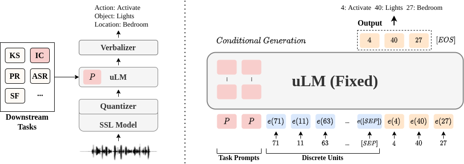

<h1> SpeechPrompt</h1>

> ### *Project Website*
> https://ga642381.github.io/SpeechPrompt/

* ***Title***: An Exploration of Prompt Tuning on Generative Spoken Language Model for Speech Processing Tasks
* This is the first work that explores **prompt tuning (discovered units level)** on Generative Spoken Lanugage Model (GSLM) for various **speech processing** tasks. 
* ***Paper Link***: https://arxiv.org/abs/2203.16773
* ***Slides***: [Interspeech2022 Oral Presentation](https://drive.google.com/file/d/1QC9sDdnobgDoO_t2oaY0fy6bfNdsK3jl/view?fbclid=IwAR3FntCnPrpmUN0xcjxwBrQFJF83K22nlXAYtGKNfCnpd1Vhy2ULzLCqIZ0)
* ***Comment***: Accepted at Interspeech 2022



## Abstract
Speech representations learned from Self-supervised learning (SSL) models have been found beneficial for various speech processing tasks.
However, utilizing SSL representations usually requires fine-tuning the pre-trained models or designing task-specific downstream models and loss functions, causing much memory usage and human labor. On the other hand, prompting in Natural Language Processing (NLP) is an efficient and widely used technique to leverage pre-trained language models (LMs). Nevertheless, such a paradigm is little studied in the speech community. We report in this paper the first exploration of the prompt tuning paradigm for speech processing tasks based on Generative Spoken Language Model (GSLM). Experiment results show that the prompt tuning technique achieves competitive performance in speech classification tasks with fewer trainable parameters than fine-tuning specialized downstream models.
We further study the technique in challenging sequence generation tasks. Prompt tuning also demonstrates its potential, while the limitation and possible research directions are discussed in this paper.

## Contributions

* We propose a unified framework based on prompt tuning for various speech processing tasks
* We achieve comparable performance with fewer trainable parameters on speech classification tasks
* We study the possibility of prompt tuning method on speech generation (speech decoding) tasks 

## Experiment Result
We comapre the proposed framework with fintuning the downstream models as in [SUPERB](https://superbbenchmark.org/leaderboard).
For speech classification tasks, it achieves a better parameter efficientcy:
* Keyword Spotting (KS): a single-label classification task
* Intent Classification (IC): a multi-label classification task


## Frederick Jelinek Memorial Summer Workshop
The authors acknowledge the support of [2022 Eighth Frederick Jelinek Memorial Summer Workshop](https://www.clsp.jhu.edu/2022-eighth-frederick-jelinek-memorial-summer-workshop/).

This is a project under the research topic: **Leveraging Pre-training Models for Speech Processing**

For more information, please refer to our website: https://jsalt-2022-ssl.github.io/

## Citation
```latex
@article{chang2022exploration,
  title={An Exploration of Prompt Tuning on Generative Spoken Language Model for Speech Processing Tasks},
  author={Chang, Kai-Wei and Tseng, Wei-Cheng and Li, Shang-Wen and Lee, Hung-yi},
  journal={arXiv preprint arXiv:2203.16773},
  year={2022}
}
```
## Code Usage
### 1. Environment

Create Conda virtual environment:
```shell
conda env create -f environment.yaml
conda activate speech_prompt
```

Install fairseq with the tested version:
```bash
git clone https://github.com/facebookresearch/fairseq.git
cd faireq/
git checkout e55e094
pip install -e ./
```


### 2. Preprocess (Downstream tasks)
convert downstream tasks' speech and label into units

**In preprocess/ folder:**
1. modify config file in each downstream tasks folder (e.g. speech_commands/config)
2. generate manifest file
3. quantize
4. postprocessing (add downstream task's label)

```bash
DOWNSTREAM=DOWNSTREAM_NAME

python preprocess/runner.py --downstream $DOWNSTREAM --action generate_manifest
python preprocess/runner.py --downstream $DOWNSTREAM --action quantized
python preprocess/runner.py --downstream $DOWNSTREAM --action postprocess
```

* Note1: We have prepared some example data in:
    * SpeechPrompt/preprocess/speech_commands/data
    * SpeechPrompt/preprocess/fluent_commands/data

    You can directly use them to have a quick start.


* Note2: There are 3 cloumns for each data point:
    **file_name** | **speech (units)** | **task labels**
    
    * reference: https://github.com/pytorch/fairseq/tree/main/examples/textless_nlp/gslm/speech2unit

### 3. Preprocess (Unit Language model)
Preprocess data into the format that fits fairseq

**In ulm_prompt/ folder:**

1. Convert data in the previous stage into the format for lanuge modeling. For example,
71 11 10 63 10 23 10 12 57 63 40 57 40 57 93 4 53 73 74 4 2 57 4 56 57 56 63 4 12 4 40 57 93 \<s\> 11

    ("\<s\>"  is the separation token)
    
    ```bash
    python make_data.py
    ```
    &rarr; generate dataset/data_prompt/

2. verbalizer
    ```bash
    python gen_labelspace.py 
    ```
    &rarr; create labelspace.json

    ```
    python verbalizer.py
    ```

    &rarr; create verbal.json <br/>
    &rarr; genearte dataset/data_freq/

3. convert the dataset/data_freq/ into binary files:
    ```bash
    python fairseq_preprocess.py
    ```
    &rarr; genearte data-bins/


### 4. Training
1. Download the pre-trained language models from:
https://github.com/pytorch/fairseq/tree/main/examples/textless_nlp/gslm/ulm
    and put the pre-trained models in pretrained_models/ folder.
    
    * In the paper, we used **HuBERT-100** and **CPC-100**

```bash
python train.py

# e.g.
python train.py --date 20220430  \
    --prompt_task IC --unit_model hubert100 \
    --prefix_prompt_length 6
```


* Important Information:
2022-04-30 21:32:51 | INFO | fairseq_cli.train | num. shared model params: 151,417,856 **(num. trained: 154,624)**

* Checkpoints will be saved into checkpoints/
[task]\_[unit_model]\_checkpoints\_[model_serial_number (date)]

* Log files will be saved into logs/
[task]\_[unit_model]\_log\_[model_serial_number (date)]

### 5. Inference (sampling)
```bash
python sample.py

# e.g.
python sample.py --prompt_task IC --unit_model hubert100 \
                 --model_date 20220430 --sample_date 20220430
```

* The output files will be saved into 
samples / samples\_[sample_date] / samples\_[task]\_[unit_model]\_[model_date].json

### 6. Performance Evaluation
```bash
python cal_acc.py
```

## References
This work is mainly based on:
1. [Generative Spoken Language Model (GSLM)](https://arxiv.org/abs/2102.01192)
2. [Prefix-Tuning](https://arxiv.org/abs/2101.00190)
3. [Fairseq](https://github.com/pytorch/fairseq)
